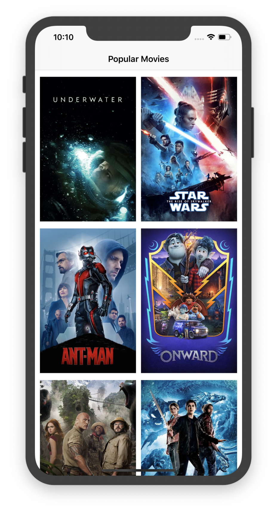
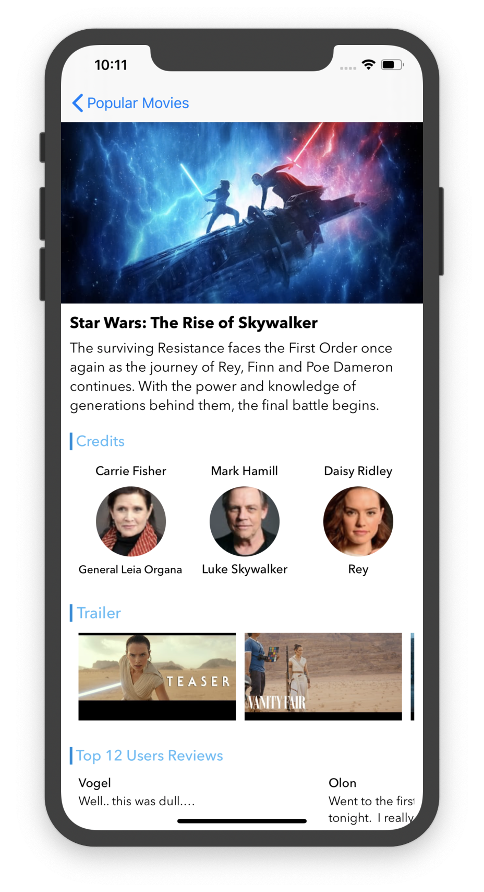

Movies iOS App
===
Example of  iOS Movie App integrated with the Themoviedb API.
https://www.themoviedb.org/documentation/api

Tech stack: MVVM + RxSwift + SDWebImage

Some screenshot for preview.

